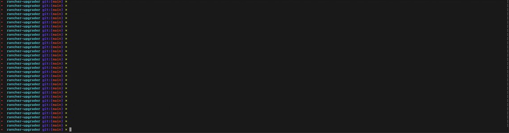

Rancher upgrader informs users on rancher release, helps users upgrade, and enforces rancher's supported upgrade path.

Rancher-upgrader's main goal is to educate users on what they're signing up for when performing a certain upgrade. The actual upgrade is just a bonus.

## Features
* Enforces support upgrade path: will upgrade to latest patch, if already on latest patch will upgrade to latest patch of next minor
* Parses relevant notes for all releases between current and target release.
    * Displays some major bugfixes and provides link to full release notes
    * Walks through known issues and prompts users to acknowledge each one before proceeding
* Reuse active override values
* Preview override values only or override values + values
* Edit override values by passing values yaml file

## Requirements
* pass valid kubeconfig with `--kubeconfig` flag
* run `rancher-upgrader` on machine with helm install
    * have rancher-stable chart repository installed

## How to Use
`rancher-upgrader --kubeconfig=<kube-config-path> upgrade`

The "upgrade" command will provide the user with an interactive prompt that guides them through an upgrade and everything they need to know.
